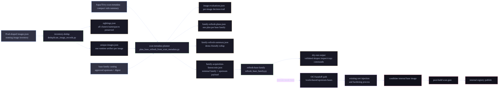

# Architecture Flow

This diagram shows the demo and target production flow at a high level.



## What Runs In The Demo

The demo runs:

- inventory dedupe
- scan metadata planning
- family-level refresh plan generation
- upstream acquisition dry-run

The demo does not run:

- real Red Hat pull
- cert injection
- hardening
- image rebuild
- final candidate scan
- internal registry push
- cluster mutation

## Safety Boundary

The current acquisition worker only proves the control-plane decision:

```text
family -> approved upstream image -> pinned digest -> handoff path
```

It defaults to `dry-run`, so it emits the exact `skopeo inspect` and `skopeo copy`
commands it would use later without copying anything.
